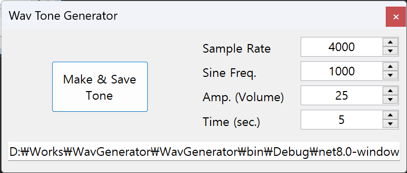

## How to use

1. Set configuration

   - Sample Rate - (4000 ~ 96000) per second
   - Frequency - (1 ~ 20000) Hz
   - Amplitude(Volume) - 0 ~ 100 %
   - Duration(Time) - 0 ~ 100 seconds

2. Set Path to Save

   - Typing path to save file folder

3. Generate
   - Click `Make & Save Tone` Button
   - .wav file will be saved in the path you set and Opened with Explorer
